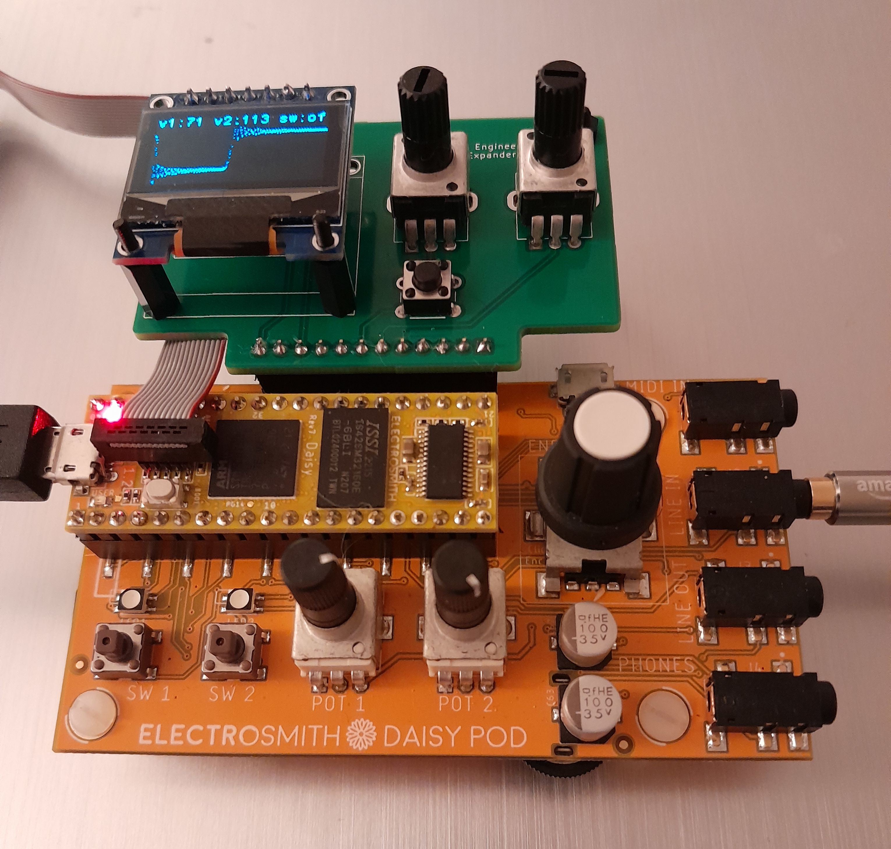

# POD Expander

Expander board for the [ElectroSmith POD](https://www.electro-smith.com/daisy/pod)

## OLED Expander (v 1.1)

Final version of the expander, adding OLED display, two potentiometers, and one button.
Firmware, KiCad 7 project and Gerber files included.

## List of parts
- 1 16 pin female header
- 1 7 pin female header
- 2 10k potentiometers
- 1 tactile switch
- 1 OLED SPI display (SSD1306)

 # Disclamer

This is a hobby project. I am not affiliated with ElectroSmith in any way. I accept no responsibility for damage to you Daisy Seed, external equipment or anything else. You use this code and hardware at your own risk. All names, logos, images, and brands are property of their respective owners.
